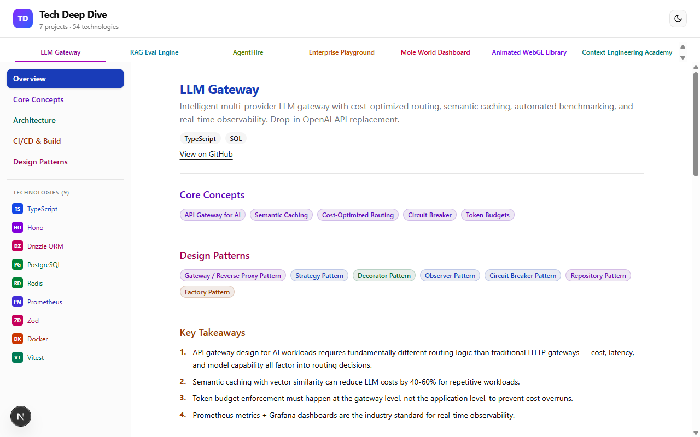
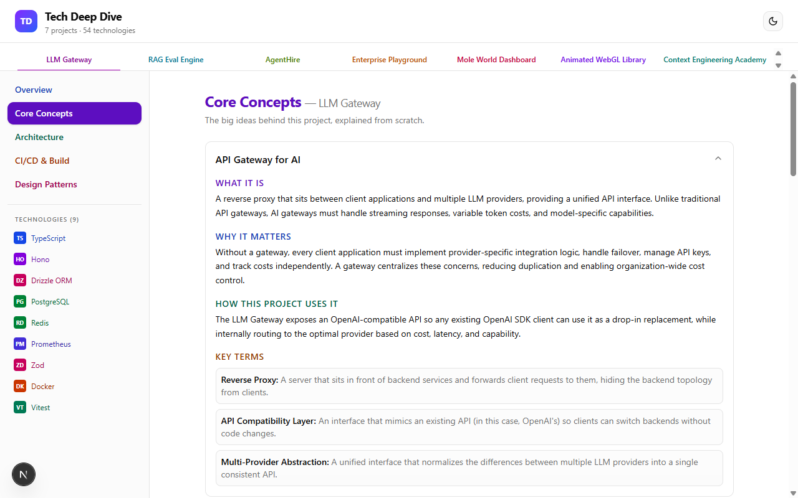
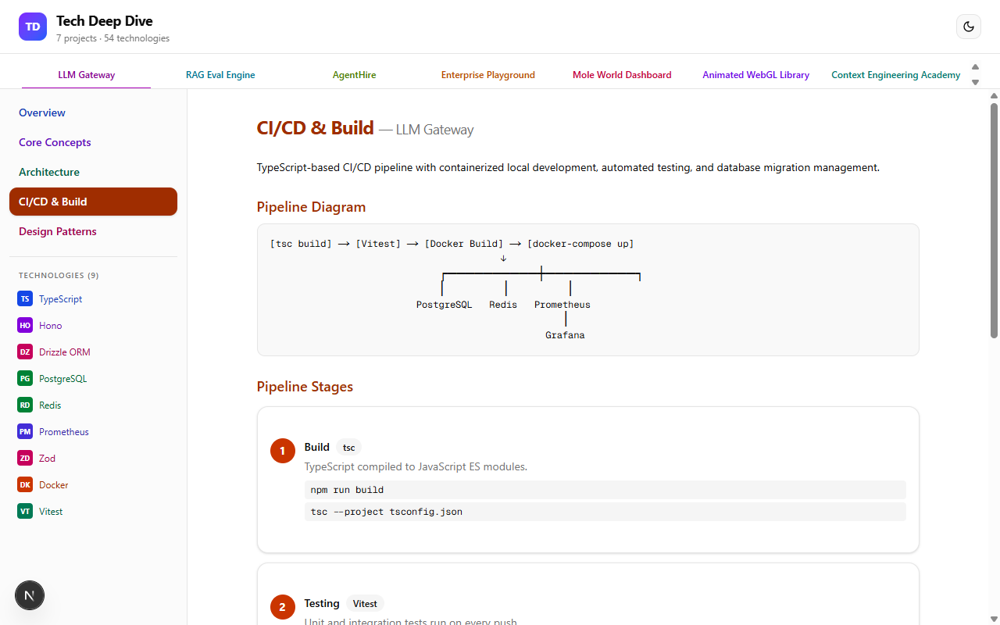
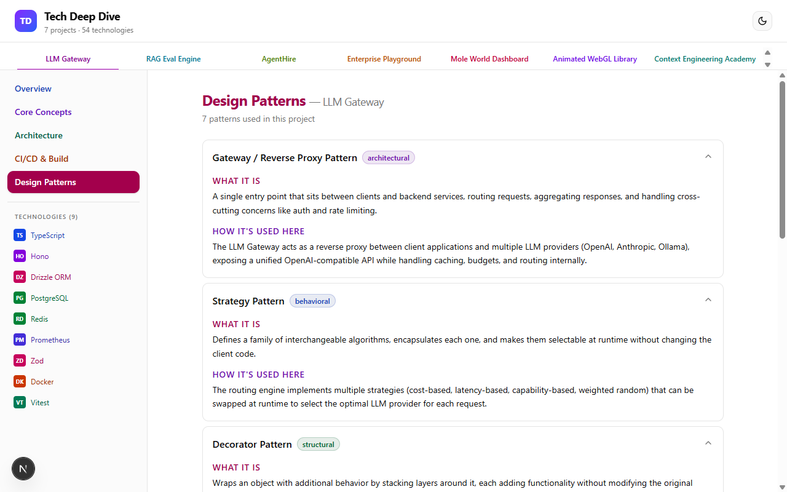
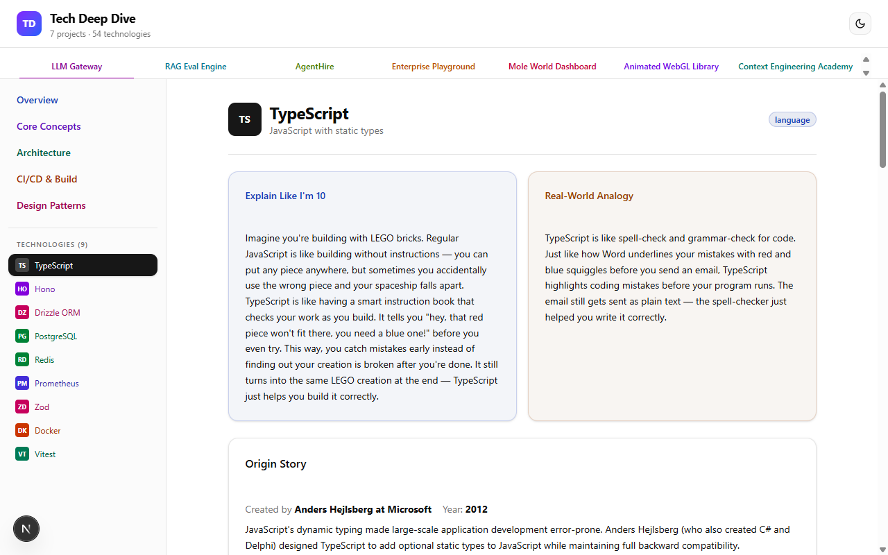
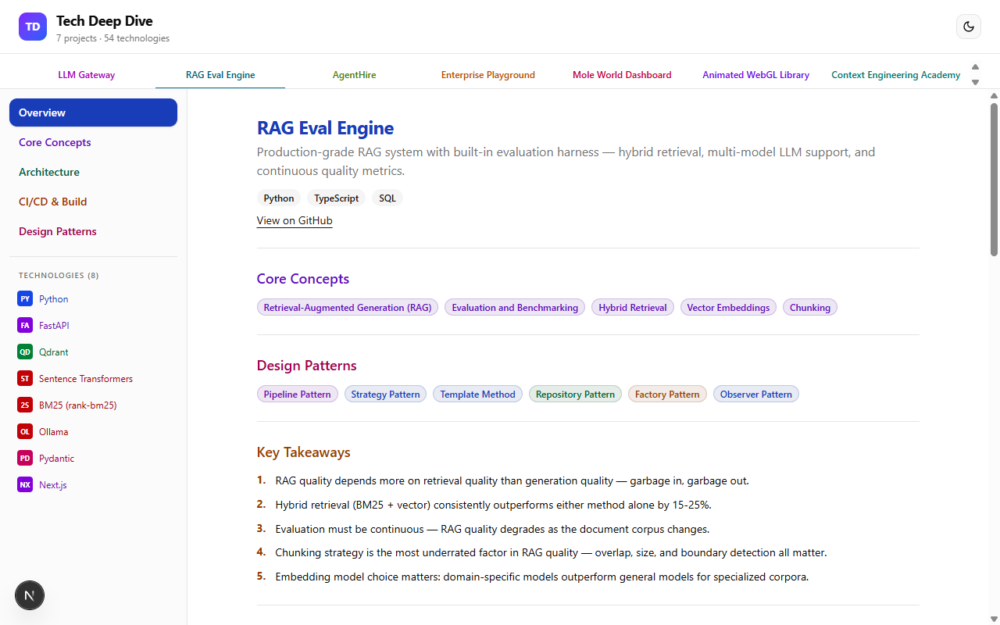
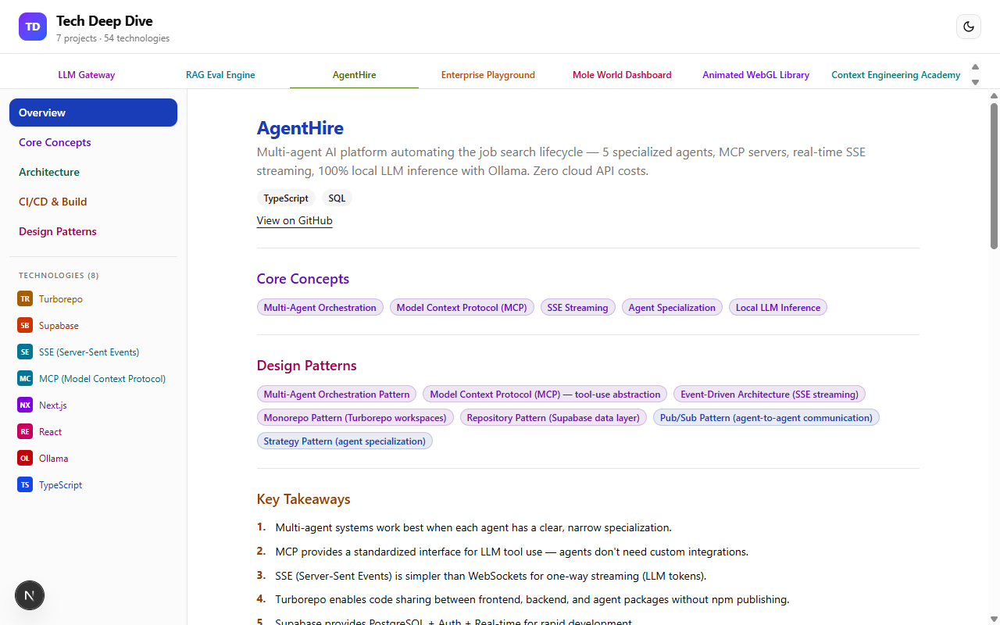
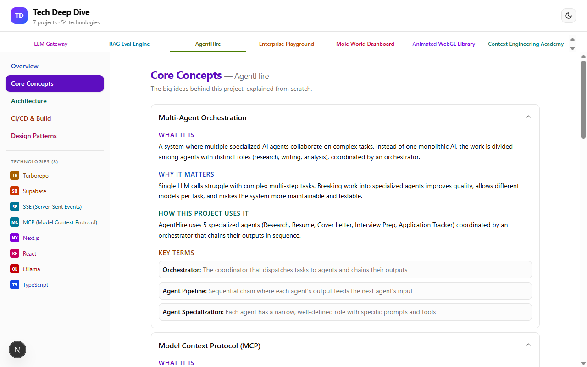
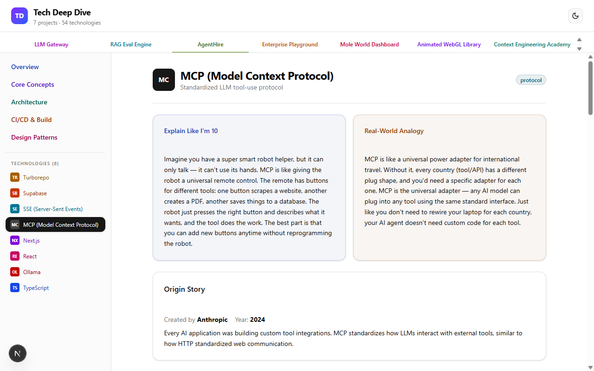
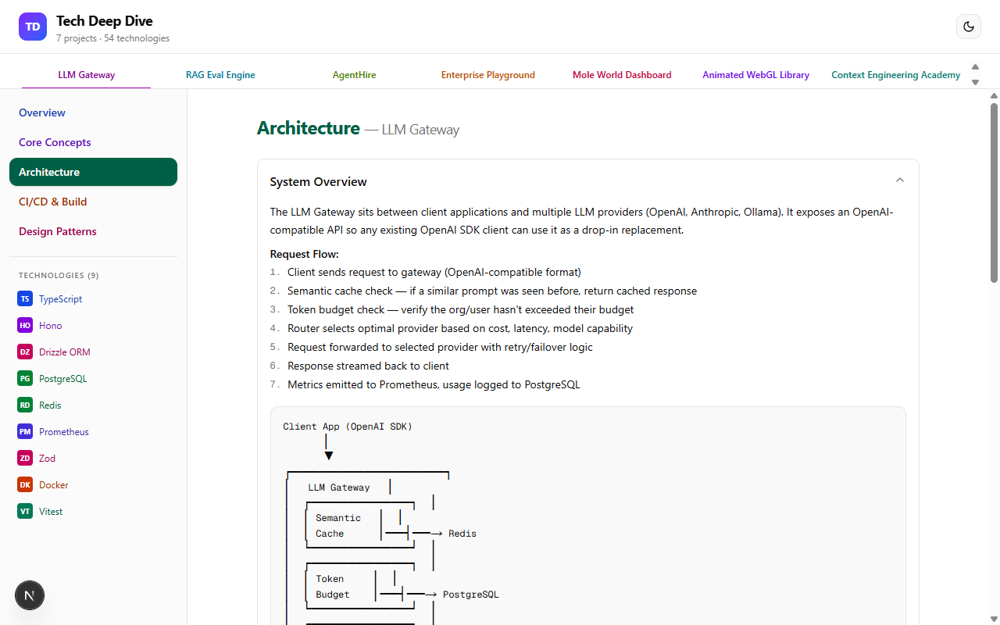

# Tech Deep Dive

An interactive knowledge base that provides deep technical breakdowns of 7 full-stack AI/ML projects and their 54 underlying technologies. Built with Next.js 16, React 19, Tailwind CSS v4, and shadcn/ui.

Each project includes core concept explanations, architecture diagrams, CI/CD pipeline breakdowns, design pattern analysis, real-world company examples, curated video resources, and technology deep-dives with ELI10 explanations, code examples, and academic foundations.

## Screenshots

<table>
  <tr>
    <td></td>
    <td></td>
    <td></td>
  </tr>
  <tr>
    <td align="center"><b>Project Overview</b><br/>Core concepts, patterns, takeaways, real-world examples</td>
    <td align="center"><b>Core Concepts</b><br/>What It Is, Why It Matters, How Project Uses It</td>
    <td align="center"><b>Architecture</b><br/>System overview with ASCII diagrams</td>
  </tr>
</table>

<table>
  <tr>
    <td></td>
    <td></td>
    <td></td>
  </tr>
  <tr>
    <td align="center"><b>CI/CD Pipeline</b><br/>Structured stages with tools and commands</td>
    <td align="center"><b>Design Patterns</b><br/>Pattern explanations with code examples</td>
    <td align="center"><b>Technology Deep Dive</b><br/>ELI10, analogy, origin story, pros/cons</td>
  </tr>
</table>

<table>
  <tr>
    <td></td>
    <td></td>
    <td></td>
  </tr>
  <tr>
    <td align="center"><b>RAG Eval Engine</b><br/>Different project with color-coded tabs</td>
    <td align="center"><b>Light Mode — LLM Gateway</b><br/>Full project overview in light theme</td>
    <td align="center"><b>Light Mode — AgentHire</b><br/>Multi-agent platform with MCP, SSE, Ollama</td>
  </tr>
</table>

<table>
  <tr>
    <td></td>
    <td></td>
    <td></td>
  </tr>
  <tr>
    <td align="center"><b>Light Mode — Core Concepts</b><br/>Accordion-based concept exploration</td>
    <td align="center"><b>Light Mode — Tech Viewer</b><br/>MCP deep dive with ELI10, analogy, origin</td>
    <td align="center"><b>Light Mode — Architecture</b><br/>System overview with ASCII diagrams</td>
  </tr>
</table>

## Projects Covered

| Project | Description | Technologies |
|---------|-------------|:------------:|
| **LLM Gateway** | Multi-tenant SaaS LLM gateway with semantic caching, cost-optimized routing, Stripe billing, and Next.js dashboard | 9 |
| **RAG Eval Engine** | Production RAG system with hybrid retrieval and evaluation harness | 8 |
| **AgentHire** | Multi-agent AI platform with MCP servers, SSE streaming, local LLM inference | 8 |
| **Enterprise Playground** | Fine-tuning platform with QLoRA, web scraping, domain-specific training | 8 |
| **Mole World Dashboard** | AI video generation pipeline with ComfyUI workflows | 7 |
| **Animated WebGL Library** | GPU-accelerated animation library with GLSL shaders | 7 |
| **Context Engineering Academy** | Educational platform for context engineering and prompt design | 7 |

## What Each Technology Gets

Every technology (54 total) includes:

- **ELI10** — Explain Like I'm 10
- **Real-World Analogy** — Relatable comparison
- **Origin Story** — Creator, year, motivation
- **What It Is** — Technical definition with markdown
- **Why We Used It** — Project-specific rationale
- **How It Works** — Implementation details with code
- **Features Using It** — Numbered feature list
- **Core Concepts & Code** — Deep-dive with syntax-highlighted code blocks
- **Pros & Cons** — Balanced analysis
- **Alternatives** — Competitor comparisons
- **Key APIs & Commands** — Quick reference
- **Academic Foundations** — CS theory connections
- **Further Reading** — Curated resources

## What Each Project Gets

Every project includes:

- **Core Concepts** — 3-5 big ideas explained from scratch (What It Is, Why It Matters, How Project Uses It, Key Terms)
- **Architecture** — System overview with ASCII diagrams, component breakdowns with markdown
- **CI/CD Pipeline** — Structured stages with tool badges, commands, infrastructure details
- **Design Patterns** — Pattern explanations with category badges and code examples
- **Real-World Examples** — Companies using similar patterns (with favicons)
- **Video Resources** — Curated YouTube links with thumbnails
- **Key Takeaways** — Numbered insights

## Tech Stack

- **Next.js 16** — App Router, static export
- **React 19** — Server Components, Suspense
- **Tailwind CSS v4** — Utility-first styling
- **shadcn/ui** — Radix-based component library (Accordion, Badge, Card, Tabs, Separator)
- **next-themes** — Dark/light mode with system preference detection
- **TypeScript** — Strict mode

## Getting Started

```bash
# Install dependencies
npm install

# Run development server
npm run dev

# Build for production
npm run build
```

Open [http://localhost:3000](http://localhost:3000) in your browser.

## Project Structure

```
src/
├── app/
│   ├── layout.tsx          # Root layout with theme provider
│   ├── page.tsx            # Home page
│   └── globals.css         # Tailwind + CSS variables
├── components/
│   ├── project-explorer.tsx    # Main app shell (sidebar, tabs, all views)
│   ├── technology-viewer.tsx   # Technology deep-dive viewer
│   ├── markdown-block.tsx      # Shared markdown renderer
│   ├── theme-toggle.tsx        # Dark/light mode toggle
│   ├── theme-provider.tsx      # next-themes provider wrapper
│   └── ui/                     # shadcn/ui components
├── data/
│   ├── types.ts                # TypeScript interfaces
│   └── projects/               # 7 project data files (technologies embedded)
└── lib/
    └── utils.ts                # cn() helper, YouTube ID extractor
```

## License

MIT
